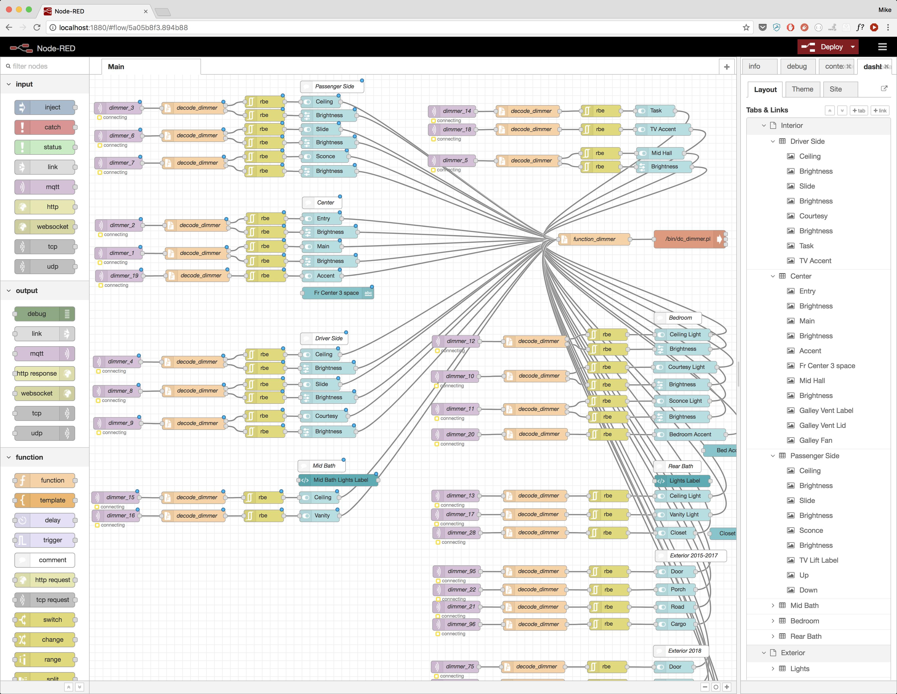

RVC-Proxy
=========

A collection of code to communicate with [RV-C
devices](https://en.wikipedia.org/wiki/RV-C) on a [CAN
bus](https://en.wikipedia.org/wiki/CAN_bus) network.

For more information on the RV-C protocol, please visit
[www.rv-c.com](http://www.rv-c.com/). Download the complete [RV-C
specification](http://www.rv-c.com/?q=node/75) for details on the
commands and their parameters. This PDF file is critical for
understanding how to communicate with RV-C devices.

Prerequisites
-------------

Required:

* A computer with a canbus network card configured on interface `can0`.

Optional:

* The [Node-RED](https://nodered.org/) programming environment installed
  along with the [Node-RED Dashboard](https://github.com/node-red/node-red-dashboard)
  package for building user interfaces.
* An [MQTT](http://mqtt.org/) message broker for passing messages
  between programs. We recommend the [Mosquitto](https://mosquitto.org/) message broker.

Receiving RV-C Messages from CANbus
-----------------------------------

### rvc2mqtt.pl

Listens for RV-C messages on a canbus network, decodes them, and
publishes summary information in JSON format to an MQTT message broker
on the local host.

This script loads `rvc-spec.yml`, a machine readable version of the RV-C
specification in [YAML](https://yaml.org/spec/1.2/spec.html) format.
The file describes how to decode each byte and bit of the data stream
into keys and values.

_Note 1: There are are few RV-C DGN decoders remaining to be added to
the `rvc-spec.yml` file._

_Note 2: The RV-C spec PDF has errors and inaccuracies. Where possible,
comments have been included in the `rvc-spec.yml` to explain the
discrepencies._

_Note 3: The `rvc-spec.yml` file is versioned, so that any changes to
the mqtt output can be tracked and downstream scripts can be updated.
Please review the [decoder API version log](rvc2mqtt-api-versions.md)._

For example, the `rvc-spec.yml` file contains the following decoder
information for RV-C datagroup `1FF9C`, based on section 6.17.11 of the
RV-C specification:

```yaml
1FF9C:
  name: THERMOSTAT_AMBIENT_STATUS
  parameters:
    - byte: 0
      name: instance
      type: uint8
    - byte: 1-2
      name: ambient temp
      type: uint16
      unit: Deg C
```

When the `rvc2mqtt.pl` script detects a `1FF9C` data packet on the canbus,
it uses the above YAML to decode the packet and publish the following JSON
to the MQTT bus:

```json
{
  "dgn":"1FF9C",
  "name":"THERMOSTAT_AMBIENT_STATUS",
  "instance":1,
  "ambient temp":27.7,
  "data":"0197250000000000",
  "timestamp":"1550782537.136680"
}
```

### rvc_monitor.pl - DEPRECATED

The original version of the RV-C decoder. It has since been replaced
with rvc2mqtt.pl which is more reliable and scalable.

Most decoders (e.g. DC_DIMMER_STATUS_3) publish to MQTT and print to
STDOUT an ordered, comma-separated list of values. Newer decoders return
a JSON object containing key-value pairs to eliminate the requirement to
know the order of returned values.

Sending RV-C Messages to CANbus
-----------------------------------

### dc_dimmer.pl

Sends a `DC_DIMMER_COMMAND_2` message (`1FEDB`) to the CAN bus. This is
typically used to control lights, but can also be used to turn other
items on and off, such as a water pump or fan.

### dc_dimmer_pair.pl

Sends a combination of `DC_DIMMER_COMMAND_2` messages (`1FEDB`) to
control various devices which have two instances associated with them.
Over time, this script can replace `ceiling_fan.pl`, `vent_fan.pl`, and
part of `window_shade.pl`).

For example, opening and closing a ceiling vent lid on a Tiffin
motorhome requires a pair of reversing commands with a duration value.
For example, to open the galley vent lid, the following sequence is
sent:

```
Instance 27
Brightness 0
Command Off
Duration 0

Instance 26
Brightness 100%
Command On
Duration 20s
```

To close the vent lid, the following sequence is sent (note the
instances are reversed):

```
Instance 26
Brightness 0
Command Off
Duration 0

Instance 27
Brightness 100%
Command On
Duration 20s
```

### ceiling_fan.pl

Sends a combination of `DC_DIMMER_COMMAND_2` messages (`1FEDB`) to
control the bedroom ceiling fan.

### vent_fan.pl

Sends `DC_DIMMER_COMMAND_2` messages (`1FEDB`) to the CAN bus to control
the ceiling vent lids and fans in Tiffin motorhomes.

Turning fans on and off is handled via a single command, just like
turning a light on or off.

Opening and closing a vent lid requires a pair of reversing commands
with a duration value.

### window_shade.pl

Sends either `WINDOW_SHADE_COMMAND` messages (`1FEDF`) or
`DC_DIMMER_COMMAND_2` messages (`1FEDB`) to control both window shades
and outdoor awnings. In Tiffin motorhomes, most window shades and
awnings are controlled via the `WINDOW_SHADE_COMMAND`, but some some
shades use the `DC_DIMMER_COMMAND_2` instead.

To simplify the interface, a single meta ID is used in the script to
control each shade set or awning, abstracting away the need to know
which RV-C command to send. For example, ID 1 sends
`DC_DIMMER_COMMAND_2` messages to dimmers 77 through 80 to control the
up and down motion of the day and night shades next to the passenger
side dinette.

In addition, different model years use slightly different versions of
the RV-C commands, so the model year must be supplied on the command
line.

Example usage: `window_shade.pl 2018 night up 17` will generate an RV-C
command to roll up the entry door night shade.

User Interface
--------------

The `flows_rvcproxy.json` file inside the `node-red` directory contains
a set of Node-RED flows for creating a dashboard to control lights,
vents, fans, thermostats, and more. Please see the [documentation for
Node-RED](https://nodered.org/docs/) for instructions to load and work
with this file.

The flows utilize several Node-RED modules which must be installed
first. At the very least, the following are required:

* node-red-dashboard
* node-red-contrib-file-function-ext

The `file-function-ext` module loads javascript code snippets from
files, rather than the traditional approach of embedding the javascript
code inside the Node-RED flows file. Several sample javascript files
have been added to this repository.



